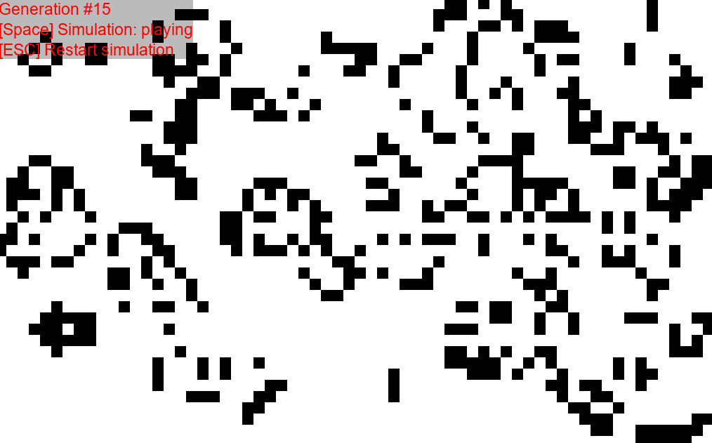

# Game Of Life

This is my implementation of Conway's Game Of Life made in Godot 3. That was fun :D

ESC - Restart simulation
Space - Pause/resume simulation
Mouse click - Place new cells.

You can play it here: https://raphaklaus.itch.io/game-of-life
